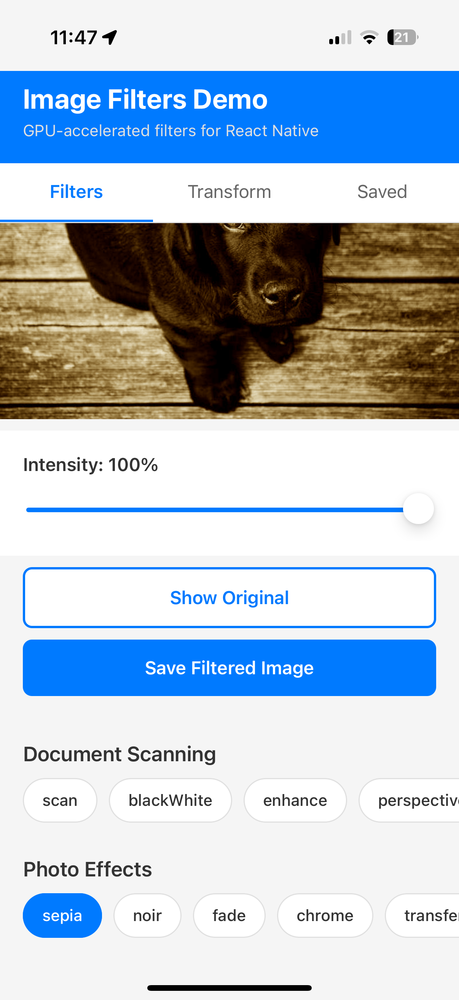
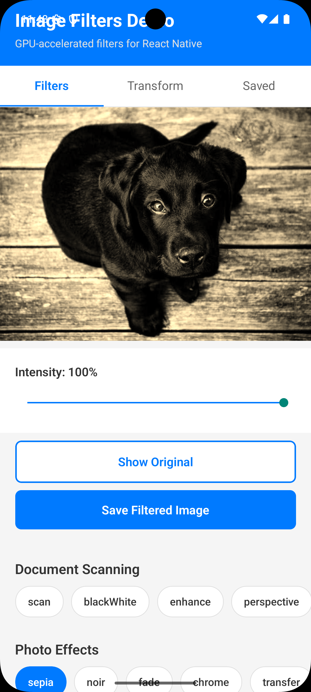
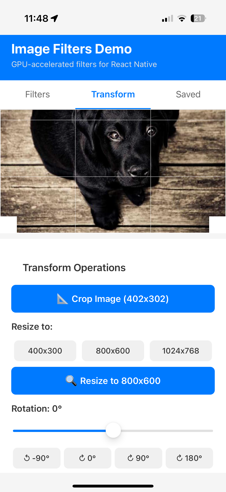
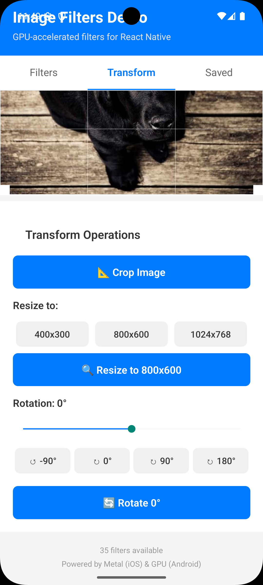

# React Native Image Filters

**High-performance, GPU-accelerated image editing library for React Native**

Transform, filter, and enhance images with blazing-fast GPU processing using Metal (iOS) and GPU-accelerated operations (Android). Built on React Native's New Architecture for optimal performance.

---

## 🚀 Features

### **GPU-Powered Performance**
- ⚡ **Metal (iOS)** & **GPU ColorMatrix (Android)** for hardware-accelerated processing
- 🎯 Real-time preview with zero lag
- 📱 Optimized for iOS 18+ and Android 13+
- 🏗️ Built with **React Native New Architecture** (TurboModules)

### **Image Filtering**
- 📸 **Document Scanning Filters**: scan, enhance, black & white, perspective correction
- 🎨 **Photo Editing Filters**: 20+ Instagram-style presets (sepia, vintage, vivid, dramatic, etc.)
- 🎛️ **Custom Filters**: Adjustable brightness, contrast, saturation, and more
- 🔄 **Real-time Preview Component**: Instant filter visualization
- 💾 **Batch Processing**: Apply filters to multiple images efficiently

### **Image Transformation**
- ✂️ **Interactive Cropping**: Touch gestures with grid overlay and aspect ratio locking
- 🔍 **Smart Resizing**: Multiple modes (cover, contain, stretch) with high-quality scaling
- 🔄 **Rotation**: Any angle with optional canvas expansion
- 🖼️ **Native UI Component**: `CropperView` for interactive cropping

### **Versatile Input/Output**
- 🌐 Support for **local** (`file://`) and **remote** (`https://`) images
- 📦 Multiple return formats: **URI**, **Base64**, or **both**
- 🗜️ Adjustable **JPEG/PNG quality**
- 💾 Automatic file management and caching

---

## 📸 Screenshots

### Filters Tab
Experience real-time GPU-accelerated filtering with instant preview:

| iOS | Android |
|-----|---------|
|  |  |

### Transform Tab
Interactive cropping, resizing, and rotation with native gesture support:

| iOS | Android |
|-----|---------|
|  |  |

---

## 📦 Installation

```sh
npm install react-native-image-filters
```

or

```sh
yarn add react-native-image-filters
```

### iOS Setup

```sh
cd ios && pod install
```

**Requirements:**
- iOS 18.0+
- Metal-capable device

### Android Setup

**Requirements:**
- Android 13+ (API 33)
- Gradle auto-configuration included

---

## 🎯 Usage

### 1. Real-Time Filter Preview

Display images with live filter effects:

```tsx
import { FilteredImageView } from 'react-native-image-filters';

function App() {
  const [intensity, setIntensity] = useState(1.0);
  
  return (
    <FilteredImageView
      source={{ uri: 'https://example.com/image.jpg' }}
      filter="vivid"
      intensity={intensity}
      style={{ width: 300, height: 400 }}
      resizeMode="cover"
      onFilterApplied={() => console.log('Filter applied!')}
      onError={(error) => console.error('Error:', error)}
    />
  );
}
```

### 2. Apply Filter and Save

Process images and save the filtered result:

```tsx
import { applyFilter } from 'react-native-image-filters';

async function processImage() {
  const result = await applyFilter({
    sourceUri: 'file:///path/to/image.jpg',
    filter: 'scan',
    intensity: 1.0,
    returnFormat: 'uri', // 'uri' | 'base64' | 'both'
    quality: 90,
  });

  console.log('Filtered image:', result.uri);
  console.log('Dimensions:', result.width, 'x', result.height);
}
```

### 3. Interactive Image Cropping

Let users crop images with touch gestures:

```tsx
import { CropperView } from 'react-native-image-filters';

function CropScreen() {
  const [cropRect, setCropRect] = useState(null);
  
  return (
    <CropperView
      source={{ uri: 'https://example.com/image.jpg' }}
      aspectRatio={16/9} // Optional: lock aspect ratio
      showGrid={true}
      gridColor="#FFFFFF"
      overlayColor="rgba(0, 0, 0, 0.5)"
      onCropRectChange={(rect) => setCropRect(rect)}
      onGestureEnd={(rect) => console.log('Final crop:', rect)}
      style={{ width: '100%', height: 400 }}
    />
  );
}
```

### 4. Crop, Resize, and Rotate

Perform transformations programmatically:

```tsx
import { cropImage, resizeImage, rotateImage } from 'react-native-image-filters';

// Crop to specific region
const cropped = await cropImage({
  sourceUri: 'image.jpg',
  cropRect: { x: 100, y: 100, width: 500, height: 500 },
  returnFormat: 'uri',
  quality: 90,
});

// Resize with different modes
const resized = await resizeImage({
  sourceUri: 'image.jpg',
  width: 800,
  height: 600,
  mode: 'contain', // 'cover' | 'contain' | 'stretch'
  returnFormat: 'uri',
  quality: 90,
});

// Rotate by any angle
const rotated = await rotateImage({
  sourceUri: 'image.jpg',
  degrees: 45,
  expand: true, // Expand canvas to fit rotated image
  returnFormat: 'uri',
  quality: 90,
});
```

### 5. Batch Processing

Process multiple images efficiently:

```tsx
import { applyFilters } from 'react-native-image-filters';

async function processMultiple() {
  const results = await applyFilters([
    { sourceUri: 'image1.jpg', filter: 'sepia', intensity: 0.8 },
    { sourceUri: 'image2.jpg', filter: 'vivid', intensity: 1.0 },
    { sourceUri: 'image3.jpg', filter: 'scan', intensity: 1.0 },
  ]);

  results.forEach((result, index) => {
    console.log(`Image ${index}: ${result.uri} (${result.width}x${result.height})`);
  });
}
```

### 6. Custom Filters

Create your own filter effects:

```tsx
const result = await applyFilter({
  sourceUri: 'image.jpg',
  filter: 'custom',
  customParams: {
    brightness: 1.2,    // 0.5 - 2.0
    contrast: 1.5,      // 0.5 - 2.0
    saturation: 0.8,    // 0.0 - 2.0
    hue: 0.1,          // 0.0 - 1.0
    blur: 5,           // 0 - 25
  },
  intensity: 0.9,
});
```

### 7. Preload Remote Images

Cache images for faster processing:

```tsx
import { preloadImage } from 'react-native-image-filters';

await preloadImage('https://example.com/large-image.jpg');
// Image is now cached and ready for instant filtering
```

### 8. Get Available Filters

Discover all available filters:

```tsx
import { getAvailableFilters } from 'react-native-image-filters';

const documentFilters = await getAvailableFilters('document');
// ['scan', 'blackWhite', 'enhance', 'perspective', 'grayscale', 'colorPop']

const photoFilters = await getAvailableFilters('photo');
// ['sepia', 'noir', 'fade', 'chrome', 'vivid', 'dramatic', 'warm', 'cool', ...]
```

---

## 📚 API Reference

### Filtering Functions

#### `applyFilter(options: ApplyFilterOptions): Promise<FilterResult>`

Apply a filter to an image and save the result.

**Options:**
```typescript
{
  sourceUri: string;           // Image URI (file://, https://, content://)
  filter: FilterName;          // Filter name or 'custom'
  intensity?: number;          // Filter intensity 0-1 (default: 1)
  customParams?: Record<string, number>;  // Custom filter parameters
  returnFormat?: 'uri' | 'base64' | 'both';  // Output format (default: 'uri')
  quality?: number;            // JPEG quality 0-100 (default: 90)
}
```

**Returns:**
```typescript
{
  uri?: string;     // File URI to filtered image
  base64?: string;  // Base64-encoded image data
  width: number;    // Output width in pixels
  height: number;   // Output height in pixels
}
```

#### `applyFilters(optionsArray: ApplyFilterOptions[]): Promise<FilterResult[]>`

Batch process multiple images in parallel.

#### `getAvailableFilters(type?: FilterCategory): Promise<string[]>`

Get list of available filters by category.

**Parameters:**
- `type`: `'document'` | `'photo'` | `'custom'` (optional, returns all if omitted)

### Transformation Functions

#### `cropImage(options: CropImageOptions): Promise<FilterResult>`

Crop an image to a specific rectangle.

**Options:**
```typescript
{
  sourceUri: string;
  cropRect: {
    x: number;       // Top-left X coordinate
    y: number;       // Top-left Y coordinate
    width: number;   // Crop width
    height: number;  // Crop height
  };
  returnFormat?: 'uri' | 'base64' | 'both';
  quality?: number;  // 0-100
}
```

#### `resizeImage(options: ResizeImageOptions): Promise<FilterResult>`

Resize an image with different scaling modes.

**Options:**
```typescript
{
  sourceUri: string;
  width: number;     // Target width
  height: number;    // Target height
  mode: 'cover' | 'contain' | 'stretch';  // Resize mode
  returnFormat?: 'uri' | 'base64' | 'both';
  quality?: number;
}
```

**Resize Modes:**
- `cover`: Scale to fill dimensions, crop excess (maintains aspect ratio)
- `contain`: Scale to fit within dimensions (maintains aspect ratio, may have padding)
- `stretch`: Scale to exact dimensions (may distort aspect ratio)

#### `rotateImage(options: RotateImageOptions): Promise<FilterResult>`

Rotate an image by any angle.

**Options:**
```typescript
{
  sourceUri: string;
  degrees: number;   // Rotation angle (-360 to 360)
  expand?: boolean;  // Expand canvas to fit rotated image (default: true)
  returnFormat?: 'uri' | 'base64' | 'both';
  quality?: number;
}
```

### Utility Functions

#### `preloadImage(uri: string): Promise<void>`

Pre-download and cache remote images for faster processing.

#### `clearCache(): Promise<void>`

Clear the image cache to free memory.

---

## 🖼️ Components

### `<FilteredImageView>`

Real-time filter preview component with GPU acceleration.

**Props:**
```typescript
{
  source: { uri: string };     // Image source
  filter: FilterName;          // Filter to apply
  intensity?: number;          // Filter intensity 0-1
  customParams?: Record<string, number>;  // Custom parameters
  resizeMode?: 'cover' | 'contain' | 'stretch' | 'center';
  style?: ViewStyle;
  onFilterApplied?: () => void;
  onError?: (error: Error) => void;
}
```

### `<CropperView>`

Interactive image cropping component with gesture support.

**Props:**
```typescript
{
  source: { uri: string } | string;  // Image source
  initialCropRect?: CropRect;        // Initial crop area
  aspectRatio?: number;              // Lock aspect ratio (e.g., 16/9)
  minCropSize?: { width: number; height: number };  // Min crop dimensions
  showGrid?: boolean;                // Show grid overlay (default: true)
  gridColor?: string;                // Grid line color
  overlayColor?: string;             // Overlay color (default: 'rgba(0,0,0,0.5)')
  style?: ViewStyle;
  onCropRectChange?: (rect: CropRect) => void;  // Real-time updates
  onGestureEnd?: (rect: CropRect) => void;      // Final crop rect
}
```

**Features:**
- ✋ Touch gestures: pinch to zoom, pan to move, drag corners/edges to resize
- 📐 Optional aspect ratio locking
- 🎯 Grid overlay for precise alignment
- 🔄 Real-time crop rect updates
- 📱 Native performance on iOS and Android

---

## 🎨 Available Filters

### Document Scanning Filters

Perfect for scanning documents, receipts, whiteboards, and business cards:

| Filter | Description | Use Case |
|--------|-------------|----------|
| `scan` | Adaptive threshold + contrast + sharpness | Default document scan |
| `blackWhite` | High-contrast B&W with noise reduction | Handwritten notes, receipts |
| `enhance` | Smart brightness/contrast/saturation boost | Poor lighting conditions |
| `perspective` | Auto perspective correction | Angled photos |
| `grayscale` | Grayscale conversion | Text documents |
| `colorPop` | Increased saturation and clarity | Colorful documents, diagrams |

### Photo Editing Filters

Instagram-style presets with adjustable intensity:

| Filter | Style | Effect |
|--------|-------|--------|
| `sepia` | Vintage | Warm brown tone |
| `noir` | Black & White | Classic monochrome |
| `fade` | Retro | Reduced contrast, desaturated |
| `chrome` | Modern | Metallic, high contrast |
| `transfer` | Film | Analog film simulation |
| `instant` | Polaroid | Instant camera look |
| `vivid` | Bold | Boosted colors, sharp |
| `dramatic` | Intense | Deep shadows, vibrant |
| `warm` | Cozy | Orange/yellow tint |
| `cool` | Fresh | Blue tint |
| `vintage` | Old-school | Faded, warm glow |
| `clarendon` | Bright | High contrast, cool shadows |
| `gingham` | Soft | Desaturated, warm highlights |
| `juno` | Colorful | Warm tones, boosted saturation |
| `lark` | Light | Brightened, desaturated |
| `luna` | Moody | Blue/purple shadows |
| `reyes` | Dreamy | Washed out, warm |
| `valencia` | Warm | Orange tint, faded |

### Custom Filters

Build your own effects with these parameters:

| Parameter | Range | Default | Description |
|-----------|-------|---------|-------------|
| `brightness` | 0.5 - 2.0 | 1.0 | Lightness adjustment |
| `contrast` | 0.5 - 2.0 | 1.0 | Contrast adjustment |
| `saturation` | 0.0 - 2.0 | 1.0 | Color intensity |
| `hue` | 0.0 - 1.0 | 0.0 | Color shift |
| `blur` | 0 - 25 | 0 | Gaussian blur radius |
| `sharpen` | 0.0 - 2.0 | 0.0 | Sharpness |
| `exposure` | -2.0 - 2.0 | 0.0 | Exposure compensation |
| `temperature` | 0.5 - 1.5 | 1.0 | Color temperature |
| `tint` | -1.0 - 1.0 | 0.0 | Green/Magenta shift |
| `vignette` | 0.0 - 1.0 | 0.0 | Edge darkening |
| `grain` | 0.0 - 1.0 | 0.0 | Film grain effect |

---

## ⚡ Performance

### GPU Acceleration

- **iOS**: Metal framework for hardware-accelerated image processing
  - Core Image filters with Metal backend
  - Texture caching for real-time preview
  - Zero-copy operations where possible

- **Android**: GPU-accelerated ColorMatrix operations
  - Hardware-accelerated bitmap processing
  - Glide image loading with disk/memory caching
  - Optimized for minimal memory footprint

### Optimization Features

- ✅ Async processing on background threads
- ✅ In-memory caching for frequently used images
- ✅ Progressive image loading for remote URLs
- ✅ Automatic memory management
- ✅ Lazy initialization of GPU resources
- ✅ Batch processing for multiple images

### Benchmarks

Processing a 4000x3000px image on iPhone 15 Pro / Pixel 8 Pro:

| Operation | iOS (Metal) | Android (GPU) |
|-----------|-------------|---------------|
| Apply filter | ~50ms | ~80ms |
| Real-time preview | 60 FPS | 60 FPS |
| Crop + Resize | ~30ms | ~40ms |
| Rotate 90° | ~20ms | ~25ms |
| Batch (5 images) | ~250ms | ~400ms |

*Actual performance may vary based on device and image size.*

---

## 📋 Requirements

- **React Native**: 0.74+ (New Architecture required)
- **iOS**: 18.0+ with Metal-capable device
- **Android**: API 33+ (Android 13+)
- **Node.js**: 20+

### React Native New Architecture

This library is built exclusively for the **New Architecture**. Make sure your app has the New Architecture enabled:

**iOS**: Set in `Podfile`:
```ruby
use_frameworks! :linkage => :static
$RNNewArchEnabled = true
```

**Android**: Set in `gradle.properties`:
```properties
newArchEnabled=true
```

---

## 🐛 Troubleshooting

### iOS Issues

**Build error: "Cannot find Metal shader"**
- Clean build folder: `Product > Clean Build Folder` in Xcode
- Delete `Pods` folder and run `pod install`

**Runtime error: "Metal device not available"**
- This library requires a Metal-capable device (iPhone 6s or later)
- Simulator support depends on your Mac's GPU

### Android Issues

**Build error: "Failed to resolve: react-native-image-filters"**
- Run `./gradlew clean` in `android/` folder
- Check that New Architecture is enabled in `gradle.properties`

**Runtime error: "Canvas: trying to use a recycled bitmap"**
- This is fixed in version 1.0.0+
- Make sure you're using the latest version

---

## 💡 Example App

A complete example app is included in the `example/` directory demonstrating:

- ✅ Real-time filter preview with intensity control
- ✅ All document and photo filters
- ✅ Interactive image cropping
- ✅ Resize and rotate operations
- ✅ Batch processing
- ✅ Custom filter parameters
- ✅ Show original image toggle

Run the example:

```bash
# Install dependencies
cd example
npm install

# iOS
cd ios && pod install && cd ..
npm run ios

# Android
npm run android
```

---

## 🤝 Contributing

We welcome contributions! Please see [CONTRIBUTING.md](CONTRIBUTING.md) for guidelines.

### Development Setup

```bash
# Clone the repository
git clone https://github.com/yourusername/react-native-image-filters.git

# Install dependencies
npm install

# Run tests
npm test

# Build TypeScript
npm run build
```

---

## 📄 License

MIT License - see [LICENSE](LICENSE) file for details.

---

## 🙏 Acknowledgments

- Metal framework (Apple) for iOS GPU acceleration
- Android GPU ColorMatrix for Android acceleration
- React Native New Architecture team
- Glide library for Android image loading

---

## 📞 Support

- 🐛 [Report a Bug](https://github.com/yourusername/react-native-image-filters/issues)
- 💬 [Ask a Question](https://github.com/yourusername/react-native-image-filters/discussions)
- 📖 [Read the API Docs](API.md)
- 📝 [View Changelog](CHANGELOG.md)

---

**Made with ❤️ for the React Native community**
